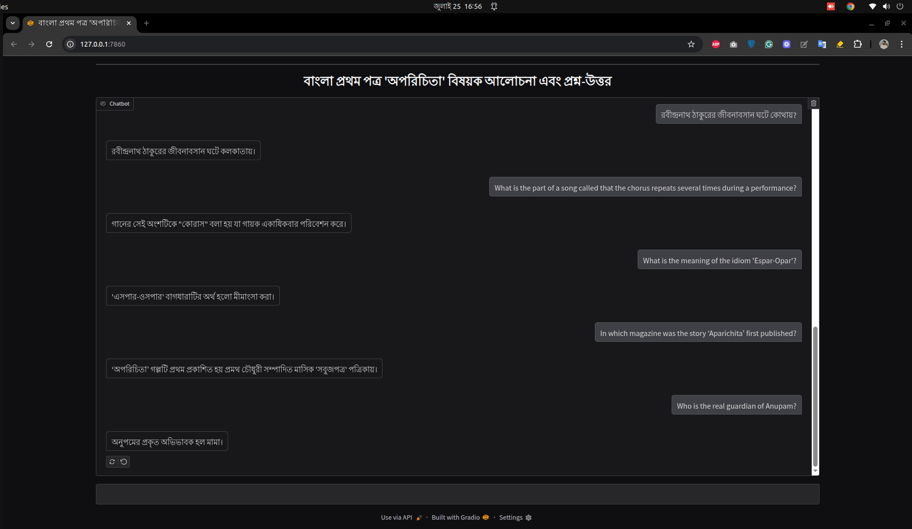
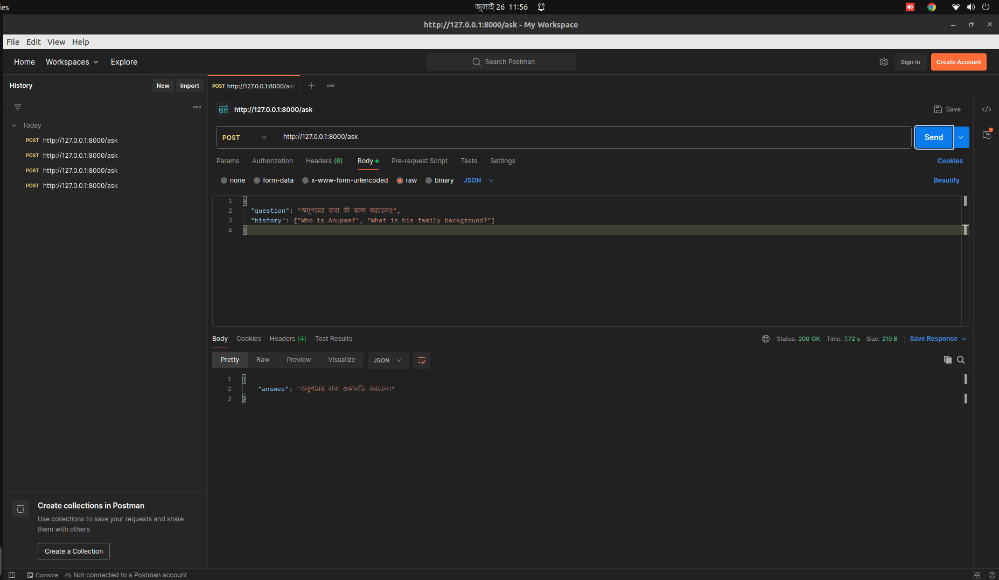

# Bangla RAG Chatbot with LangChain & FastAPI

A Retrieval-Augmented Generation (RAG) chatbot for Bangla documents, using Gemini OCR, LangChain, Chroma vector store, and FastAPI.
Source code: [GitHub Public Repo](https://github.com/yourusername/your-repo)

---

## 🚀 Setup Guide

1. **Clone the repo**

   ```sh
   git clone https://github.com/rafinrabbi/Bangla_QnAbot-with-RAG-and-LangChain.git
   cd your-repo
   ```
2. **Create and activate virtual environment**

   ```sh
   python3 -m venv venv
   source venv/bin/activate
   ```
3. **Install dependencies**

   ```sh
   pip install -r requirements.txt
   ```
4. **Set up environment variables**

   - Create a `.env` file with your OpenAI and Gemini API keys:
     ```
     OPENAI_API_KEY=your_openai_key
     GEMINI_API_KEY=your_gemini_key
     ```
5. **Run FastAPI backend**

   ```sh
   uvicorn main:app --reload
   ```
6. **Run Gradio client**

   ```sh
   python3 gradio_app.py
   ```

   The chatbot will be launched and accessible in your browser at the Gradio URL (usually [http://127.0.0.1:7860](http://127.0.0.1:7860)).

   **Sample Chatbot QnA Demo:**

   

---

## 🛠️ Used Tools, Libraries, Packages

- **LangChain**: RAG pipeline, chunking, embeddings, conversational memory
- **Chroma**: Vector database for semantic search
- **OpenAI**: Embedding and chat models (`text-embedding-3-large`, `gpt-4o-mini`)
- **FastAPI**: REST API backend
- **Gradio**: Chatbot frontend
- **Gemini OCR**: High-quality Bangla text extraction from images
- **pandas**: Data organization

---

## 💬 Sample Queries & Outputs from the RAG System

**Bangla:**

```
প্রশ্ন: অপরিচিতা গল্পের লেখক কে?
উত্তর: অপরিচিতা গল্পের লেখক রবীন্দ্রনাথ ঠাকুর।

প্রশ্ন: কার টাকার প্রতি আসক্তি বেশি?
উত্তর: অনুপমের মামার টাকার প্রতি আসক্তি বেশি। তিনি ধনীর কন্যা পছন্দ করেন না, কিন্তু টাকার প্রতি তাঁর আকর্ষণ অস্থিমজ্জায় জড়িত।

প্রশ্ন: 'তবু ইহার বিশেষ মূল্য আছে' এখানে কীসের মূল্যের কথা বলা হয়েছে?
উত্তর: এখানে 'তবু ইহার বিশেষ মূল্য আছে' বলে যে মূল্যের কথা বলা হয়েছে, তা জীবনকে বোঝানো হয়েছে। লেখক জীবনের দৈর্ঘ্য বা গুণের দিক থেকে বড় না হলেও, তার মধ্যে একটি বিশেষ মূল্য আছে, যা জীবনের অভিজ্ঞতা এবং ইতিহাসের মাধ্যমে প্রকাশ পায়। এটি সেই অনুভূতি এবং স্মৃতির উপর ভিত্তি করে, যা জীবনের মধ্যে ঘটে।

```

**English:**

```
Question: What is the main theme of 'Aparichita'?
Answer: 'অপরিচিতা' গল্পের প্রধান থিম হল যৌতুক প্রথার বিরুদ্ধে নারীর প্রতিরোধ এবং ব্যক্তিত্বের জাগরণ। গল্পে কল্যাণী নামক নারীর শক্তিশালী ব্যক্তিত্ব এবং তার পিতার সমর্থনে সমাজে প্রচলিত অমানবিক যৌতুক প্রথার বিরুদ্ধে সংগ্রামের কাহিনী বর্ণিত হয়েছে। এটি নারীর স্বাধীনতা, আত্মমর্যাদা এবং সামাজিক ন্যায় প্রতিষ্ঠার জন্য একটি গুরুত্বপূর্ণ বার্তা প্রদান করে।.

Question: Who is the real guardian of Anupam?
Answer: অনুপামের প্রকৃত অভিভাবক হল মামা।

Question: What is the meaning of the phrase "ফলের মতো গুটি"?
Answer: "ফলের মতো গুটি" বাক্যটি বোঝাতে চায় যে, গুটি এক সময় পূর্ণ ফলে পরিণত হয়। কিন্তু গুটিই যদি ফলের মতো হয় তাহলে তার অসম্পূর্ণ সারবত্তা প্রকট হয়ে ওঠে। এটি নিজের নিষ্ফল জীবনকে বোঝাতে ব্যবহৃত একটি উপমা।

```

---

## 📑 API Documentation

### POST `/ask`

**API URL:** [`http://127.0.0.1:8000/ask`](http://127.0.0.1:8000/ask)

**Example API Request in Postman:**



**Request:**

```json
{
  "question": "অনুপমের বাবা কী কাজ করতেন?",
  "history": ["Who is Anupam?", "What is his family background?"]
}
```

**Response:**

```json
{
  "answer": "অনুপমের বাবা ওকালতি করতেন।"
}
```

---

## 📊 Evaluation Matrix

### Similarity Metric Used

This project uses **cosine similarity** to compare the user query’s embedding with the stored document chunk embeddings. Cosine similarity measures the angle between two vectors in high-dimensional space, providing a value between -1 and 1 (where 1 means identical direction, i.e., maximum similarity). This metric is widely used for semantic search and retrieval tasks because it is robust to vector magnitude and focuses on the direction (semantic meaning) of the embeddings.

**How it works in this project:**

- The query and each retrieved chunk are embedded using the same embedding model (`text-embedding-3-large`).
- Cosine similarity is computed between the query embedding and each chunk embedding.
- If the maximum similarity score is below a set threshold, the system asks the user for clarification, indicating the query may be too vague or unsupported by the corpus.

**Note:**
Experiments and code for similarity and groundedness evaluation are shown in `rag_evaluation.ipynb`.

---

### Groundedness Measurement

Groundedness in this project refers to whether the chatbot’s answer is accurately supported by the source knowledge or corpus provided to the Retrieval-Augmented Generation (RAG) system. After each user query and generated response, answers are manually checked to determine if, the information in the response directly matches, paraphrases, or closely summarizes content found in the provided knowledge base/textbook. The response avoids hallucinating facts not present in the corpus.

| #  | User Question (Bangla/English)                                                                                                                           | Bot Response (Summary)                                                   | Language | Grounded? |
| -- | -------------------------------------------------------------------------------------------------------------------------------------------------------- | ------------------------------------------------------------------------ | -------- | --------- |
| 1  | What does the phrase "এই জীবনটা না দায়িত্বের হিসাবে বড়ো, না গুণের হিসাবে" imply about the character's life? | Explains character feels life is insignificant in both length and value. | English  | ✅ Yes    |
| 2  | What does "অন্তঃপুর" refer to in Indian mythology?                                                                                               | I don't know.                                                            | English  | ❌ No     |
| 3  | What is meant by the term "অন্তঃপুর" in ancient Indian context?                                                                                  | Explains it's the women's inner quarters in a traditional household.     | English  | ✅ Yes    |
| 4  | অনুপমের ভাষায় সুপুরুষ কাকে বলা হয়েছে?                                                                                 | শুম্ভুনাথ।                                                     | Bangla   | ✅ Yes    |
| 5  | কাকে অনুপমের ভাগ্য দেবতা বলে উল্লেখ করা হয়েছে?                                                                   | মামাকে।                                                           | Bangla   | ✅ Yes    |
| 6  | বিয়ের সময় কল্যাণীর প্রকৃত বয়স কত ছিল?                                                                                | ১৫ বছর।                                                            | Bangla   | ✅ Yes    |
| 7  | What does Anupam's father do for a living?                                                                                                               | Anupam's father earns a living by practicing law (ওকালতি).         | English  | ✅ Yes    |
| 8  | What was Promoth Chowdhury’s contribution to Bengali prose?                                                                                             | I don't know.                                                            | English  | ❌ No     |
| 9  | kobiguru ke? (Who is "Kobiguru"?)                                                                                                                        | রবীন্দ্রনাথ ঠাকুরকে বোঝানো হয়।              | Mixed    | ✅ Yes    |
| 10 | kisher jnno nobel peyechilo? (What did he get the Nobel for?)                                                                                            | For "Gitanjali" and other poetry; first Asian Nobel laureate.            | Mixed    | ✅ Yes    |
| 11 | Who is Anupam?                                                                                                                                           | Anupam is a character in "Aparichita," summary given.                    | English  | ✅ Yes    |
| 12 | Who is Anupam's father?                                                                                                                                  | Father not named; uncle took responsibility after his death.             | English  | ✅ Yes    |
| 13 | What do you know about Anupam?                                                                                                                           | Detailed summary of Anupam's character from "Aparichita."                | English  | ✅ Yes    |
| 14 | মামাকে ভাগ্য দেবতার প্রধান এজেন্ট বলা হয়েছে কার জন্য?                                                      | মামার প্রভাবের জন্য।                                   | Bangla   | ✅ Yes    |
| 15 | অনুপমের আসল অভিভাবক কে?                                                                                                               | অনুপমের আসল অভিভাবক হলো তার মামা।            | Bangla   | ✅ Yes    |
| 16 | What is the age difference between Anupam and his uncle in the story 'Aparichita'?                                                                       | "ছয় বছর" (six years).                                             | English  | ✅ Yes    |
| 17 | কার টাকার প্রতি আসক্তি বেশি?                                                                                                      | অনুপমের মামার টাকার প্রতি আসক্তি বেশি।  | Bangla   | ✅ Yes    |
| 18 | "Aparichita" গল্পের কর্ণের পাশে গন্ধ কেনো ছড়াছড়ি হয়েছে?                                                         | Explains with literary context and motivations.                          | Bangla   | ✅ Yes    |
| 19 | রবীন্দ্রনাথ ঠাকুর কোন অভিসন্ধানে সম্বন্ধিত হয়েছিলেন?                                                     | বিশ্বকবি, Nobel prize, literature related.                       | Bangla   | ✅ Yes    |
| 20 | তিনি কত সালে জন্মগ্রহণ করেন?                                                                                                      | ১৮৬১ সালে জন্মগ্রহণ করেন।                          | Bangla   | ✅ Yes    |

---

**Legend:**

- ✅ Yes: Answer is grounded (supported by corpus).
- ❌ No: Not grounded / Bot did not answer or hallucinated.

---

## ❓ Project Questions & Answers

### 1. What method or library did you use to extract the text, and why? Did you face any formatting challenges with the PDF content?

I first tried extracting Bangla text directly from the PDF using **PyMuPDF**, but this resulted in broken fonts and unreadable output (e.g., “ব্া়োব্ার়্ে কিাি কািকণ কনযাি র্পতা”) due to Bangla encoding issues. I then converted PDF pages to images and used **Tesseract OCR**, which gave partial results but frequently missed important content like tables. Finally, I used **Gemini OCR**, which provided high accuracy for Bangla scripts and reliable extraction even with complex formatting.

**Details of the extraction process and experiments can be found in `data_preparation.ipynb`.**

**Note on Data Cleaning:**
After OCR, most tables (especially MCQ answer tables) were not formatted properly. I had to manually check and fix these tables. Another challenge was that most MCQ answers were presented in a summary table at the end, not with the questions. To automate this, I used GPT with a custom prompt to format the MCQ and table data, matching each answer to its corresponding MCQ. The final format looked like:

৭৯. 'খাটি সোনা বটে!' বলতে বিনুদাদা কোনটিকে বুঝিয়েছে?
ক) বনেদী ঘর
খ) উপযুক্ত পাত্রী (উত্তর)
গ) সুশীল পাত্র
ঘ) পণের গহনা

Finally, I used the file `./data/extracted_text_gemini/combined_text.txt` as the cleaned and consolidated text for vectorization.

**Details of the extraction process and experiments can be found in `data_preparation.ipynb`.**

### 2. What chunking strategy did you choose? Why do you think it works well for semantic retrieval?

- **Strategy:**I used a **character-based chunking approach** with a chunk size of 1000 characters and an overlap of 200, implemented via LangChain’s `RecursiveCharacterTextSplitter`.
- **Reasoning:**
  This strategy was chosen to maintain coherent context within each chunk and to avoid losing important information at chunk boundaries. The overlap helps preserve sentence continuity, so that relevant content is not split between chunks and lost during retrieval.
  Character-based chunking is also language-agnostic, which works well for Bangla (where sentence boundaries may be harder to detect programmatically), and provides consistent chunk sizes ideal for embedding and semantic similarity search.

### 3. What embedding model did you use? Why did you choose it? How does it capture the meaning of the text?

- **Model:**I initially experimented with `distiluse-base-multilingual-cased-v1` from SentenceTransformers because of its open-source nature and strong multilingual support. However, I found that for more complex queries—especially when deep semantic context or subtle relationships are involved—the lower-dimensional embeddings (512) sometimes missed important nuances.
- **Why:**To address this, I switched to OpenAI’s `text-embedding-3-large`, which generates much higher-dimensional embeddings (3072). This provides a richer and more expressive semantic representation, improving similarity search and retrieval accuracy for both Bangla and English.
- **How:**
  The model encodes each text chunk into a high-dimensional vector that reflects its meaning, context, and relationships within the corpus. This allows the system to effectively compare queries and document chunks, even when the queries are complex or phrased differently from the original text.

### 4. How are you comparing the query with your stored chunks? Why did you choose this similarity method and storage setup?

- **Method:**I use cosine similarity to compare the user query’s embedding with the stored document chunk embeddings. This is implemented via the Chroma vector store, which efficiently indexes and retrieves semantically similar chunks.
- **Why:**
  Chroma is fast, scalable, and integrates seamlessly with LangChain. Cosine similarity is widely adopted for comparing semantic embeddings due to its robustness and interpretability.

### 5. **How do you ensure that the question and the document chunks are compared meaningfully? What would happen if the query is vague or missing context?**

- **Approach:** The query and chunks are embedded using the same model, ensuring semantic alignment. If the query is vague, the retriever may return less relevant chunks, and the LLM will indicate uncertainty or ask for clarification.

### 6. **Do the results seem relevant? If not, what might improve them?**

- **Relevance:** Most of the time, the results seem relevant, particularly for fact-based and context-rich queries. However, in some cases, the model fails to answer correctly—likely due to issues during text extraction. Before vectorization, further data cleaning and formatting is needed to preserve relationships within the content.
- **Improvements:** For even better results, consider:

  - Finer chunking (e.g., sentence or paragraph level) for more accurate context capture
  - Improved OCR and post-processing to reduce noise in the text

---

## 📂 Project Structure

```
├── main.py                   # FastAPI backend
├── gradio_app.py             # Gradio chat client
├── data_preparation.ipynb    # Data extraction and cleaning
├── rag_evaluation.ipynb      # RAG evaluation and metrics
├── requirements.txt
├── readme.md
├── chroma_db/                # Chroma vector DB files
│   ├── chroma.sqlite3
│   └── ...
├── data/
│   ├── HSC26-Bangla1st-Paper.pdf
│   ├── pdf2img/              # PDF pages as images
│   ├── extracted_text/       # Tesseract outputs
│   └── extracted_text_gemini/ # Gemini OCR outputs
│       ├── combined_text.txt
│       ├── cleaned_gemini_output.txt
│       ├── merged_gemini_output.txt
│       ├── extracted_pages.xlsx
│       ├── extracted_texts.xlsx
│       ├── page_1_description.txt
│       └── ...
└── __pycache__/              # Python bytecode cache
```

---

<!-- 
## 👤 Author

- [Your Name](https://github.com/yourusername)

---

## 📄 License

MIT -->
